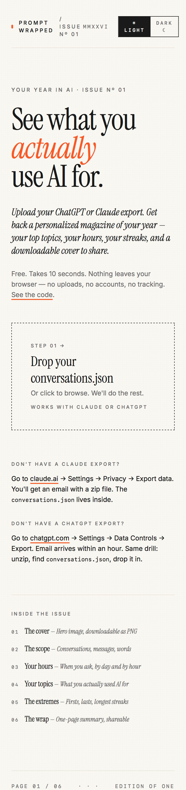
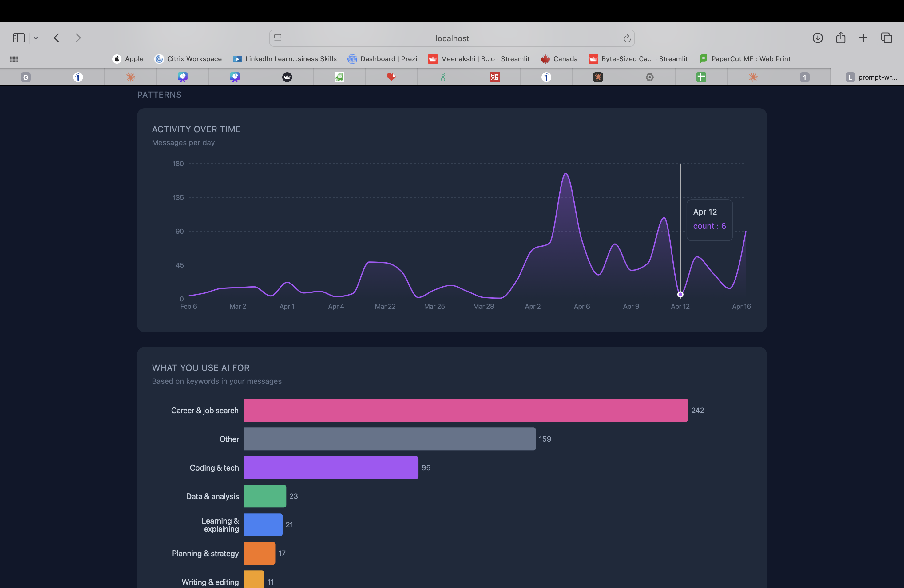
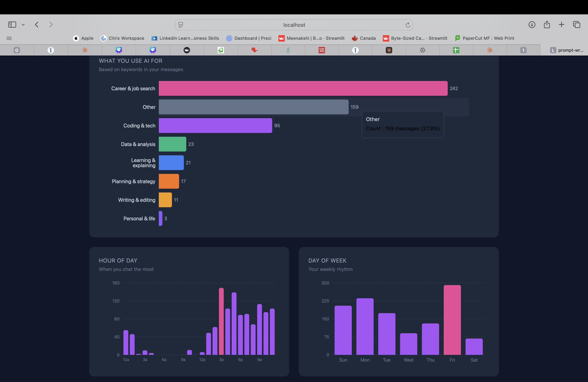
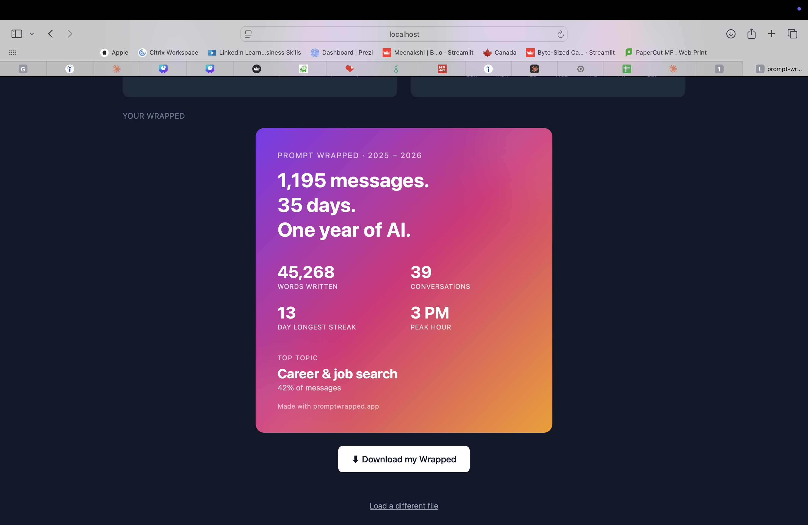

# Prompt Wrapped 🎁

> See what you actually use AI for. 100% private, your data never leaves your browser.

 



Upload your ChatGPT or Claude conversation export and get a personalized dashboard showing your AI usage patterns — when you chat, what you chat about, your longest streaks, and a shareable "Wrapped" card like Spotify's year-end summary.

## 🔒 Privacy first

Your export contains every message you've ever sent. That's personal. So **Prompt Wrapped does not have a backend.** All parsing, analytics, and chart rendering run in your browser. Nothing is uploaded, logged, or stored anywhere.

Don't take my word for it. [Read the code](./src/lib/parseClaude.ts).

## ✨ Features

- **Drag-and-drop upload** — drop in `conversations.json` from your export, done
- **Works with Claude today, ChatGPT support coming** 
- **Rich analytics dashboard** — totals, time patterns, streaks, hour-of-day, day-of-week
- **Topic classification** — see what you actually use AI for (career, coding, writing, etc.)
- **Downloadable Wrapped card** — one-click PNG export for sharing

## 📊 What you'll see

### Your stats at a glance
Totals, streaks, averages, and extremes — all on one page.

### When you use AI
Activity timeline, hour-of-day, and weekday rhythm.

### What you use AI for
Topic breakdown based on keyword classification across 8 categories.

### Your Wrapped card


Download a polished PNG of your year in AI — perfect for sharing on LinkedIn, Twitter, or just keeping as a yearly snapshot.

## 🚀 Try it

**[promptwrapped.vercel.app](https://prompt-wrapped.vercel.app/)**

Drag your Claude export, see your year in AI. Takes under 10 seconds.

### How to get your Claude export
1. Go to [claude.ai](https://claude.ai) → Settings → Privacy → Export data
2. Wait for the email (usually within minutes)
3. Unzip the file and grab `conversations.json`
4. Drag it into Prompt Wrapped

### How to get your ChatGPT export
1. Go to [chatgpt.com](https://chatgpt.com) → Settings → Data Controls → Export data
2. Wait for the email (can take a few hours)
3. Unzip the file and grab `conversations.json`
4. Drag it into Prompt Wrapped

## 🛠 Tech stack

React + TypeScript + Vite + Tailwind CSS + Recharts

## 💻 Run locally

```bash
git clone https://github.com/meenakshirnair/prompt-wrapped.git
cd prompt-wrapped
npm install
npm run dev
```

Open `http://localhost:5173` and drop your export.

## 🗺 Roadmap

- [x] Claude export support
- [x] Topic classifier (keyword-based)
- [x] Downloadable Wrapped card
- [ ] ChatGPT export support
- [ ] Smarter topic classification (embeddings-based)
- [ ] Gemini export support
- [ ] Multi-file merge (combine exports from multiple platforms)
- [ ] Dark/light theme toggle

Have an idea? [Open an issue.](https://github.com/meenakshirnair/prompt-wrapped/issues)

## 📄 License

MIT — do whatever you want with this.

## 👋 About

Built by [Meenakshi Rajeev Nair](https://www.linkedin.com/in/meenakshirnair/) — an MSBA + AI engineer pivoting into Product Analytics and AI/BA roles. This project is an intersection of both worlds: hands-on AI engineering plus behavioral analytics on my own data.

If you're hiring for Product Analyst, AI/ML Business Analyst, or similar roles, I'd love to chat.