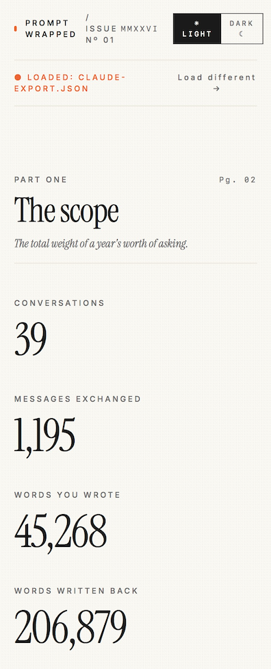
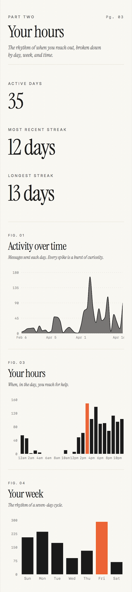
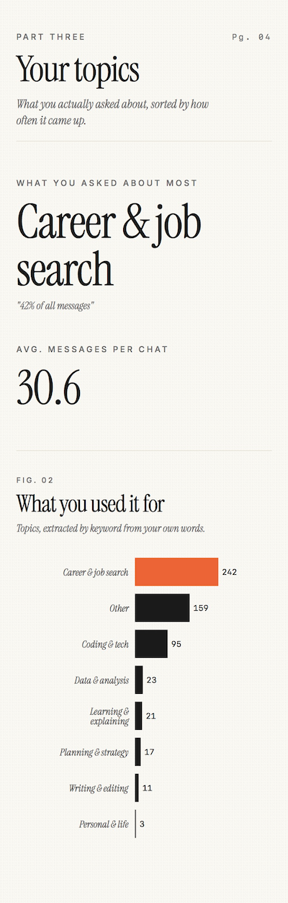
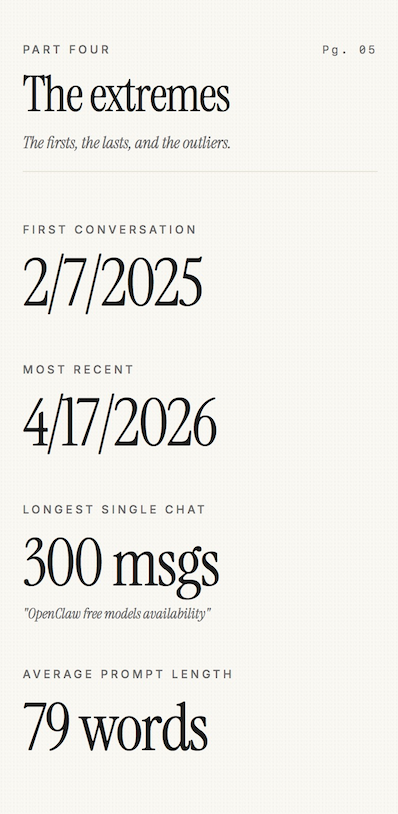
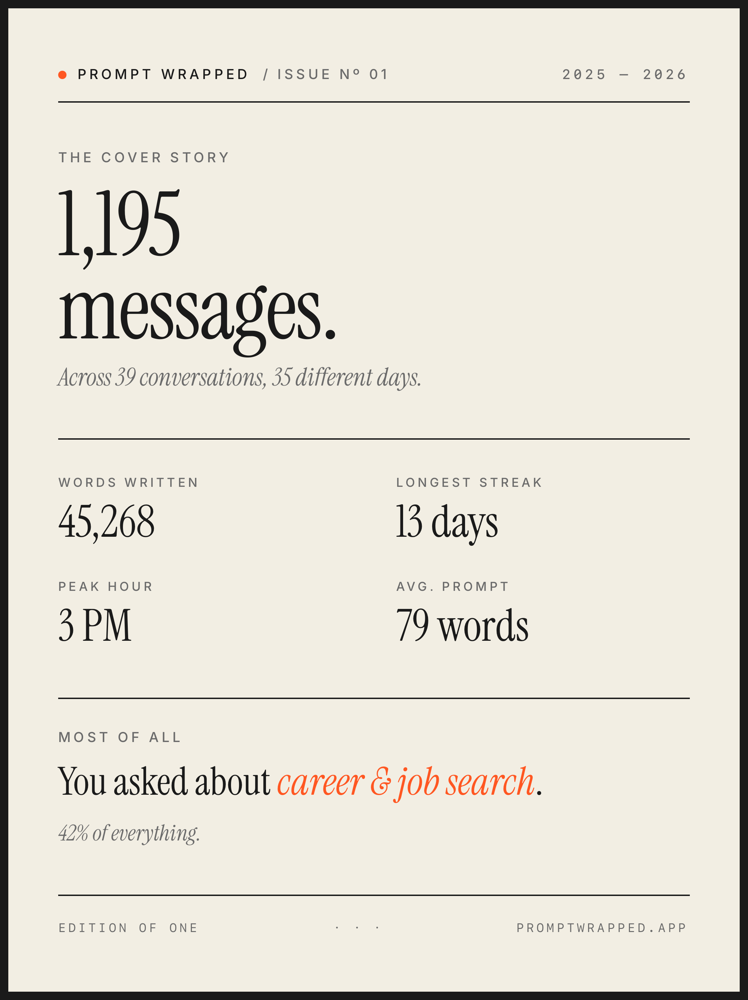

# Prompt Wrapped 🎁

> A zine about your year in AI. Upload your ChatGPT or Claude export, get a personalized magazine of your usage patterns — your top topics, your hours, your streaks, and a downloadable cover.

**[Try it now →](https://prompt-wrapped.vercel.app)**


---

## Why I built this

I'd been using Claude and ChatGPT every day for a year — for job applications, side projects, learning, life advice. I had no idea what *I* actually used AI for.

So I built a tool that does Spotify Wrapped, but for your AI conversations. Upload your export, get a personalized magazine showing your patterns. What you ask about, when you ask, how often, your longest deep-dives.

It runs entirely in your browser. Nothing uploads, no accounts, no tracking.

---

## What's in the issue

The output is laid out like a magazine, six sections deep.

### Part One — The scope
The total weight of a year. Conversations, messages, words you wrote, words written back.



### Part Two — Your hours
The rhythm of when you reach for AI. Active days, streaks, plus charts breaking down activity by day, time of day, and weekday.



### Part Three — Your topics
What you actually used AI for. A keyword classifier sorts your messages into eight categories: coding, writing, career, data, learning, planning, personal, other.



### Part Four — The extremes
Firsts, lasts, longest single conversations, average prompt length.



### The cover
A downloadable PNG of your year — designed to share. One-click LinkedIn share with an auto-generated caption based on your data.



---

## 🔒 Privacy

Your export contains every conversation you've ever had. That's personal. So **Prompt Wrapped has no backend.** All parsing and analytics happen in your browser, locally.

Don't take my word for it — [read the parsers](./src/lib/parseClaude.ts).

---

## How to use it

### Get your Claude export
1. Go to [claude.ai](https://claude.ai) → Settings → Privacy → Export data
2. Wait for the email (usually within minutes)
3. Unzip → grab `conversations.json`
4. Drop it into Prompt Wrapped

### Get your ChatGPT export
1. Go to [chatgpt.com](https://chatgpt.com) → Settings → Data Controls → Export
2. Email arrives within an hour
3. Unzip → grab `conversations.json`
4. Drop it into Prompt Wrapped

---

## Tech stack

React 18, TypeScript, Vite, Tailwind CSS, Recharts, Framer Motion, html-to-image. Deployed on Vercel.

Auto-detects the export format. Parses Claude's flat structure and ChatGPT's tree-based mapping into a common normalized schema, then runs everything off that single shape.

## Run locally

```bash
git clone https://github.com/meenakshirnair/prompt-wrapped.git
cd prompt-wrapped
npm install
npm run dev
```

Open `http://localhost:5173` and drop your export.

## Roadmap

- [x] Claude export support
- [x] ChatGPT export support
- [x] Topic classifier (keyword-based)
- [x] Downloadable cover PNG
- [x] One-click LinkedIn share with auto-generated caption
- [x] Light & dark mode
- [ ] Gemini export support
- [ ] Smarter topic classification (embeddings-based)
- [ ] Multi-file merge (combine Claude + ChatGPT data into one issue)
- [ ] Per-conversation drill-down

Have an idea? [Open an issue.](https://github.com/meenakshirnair/prompt-wrapped/issues)

## License

MIT — fork it, ship your own version, make it yours.

---

## Built by

**[Meenakshi Rajeev Nair](https://www.linkedin.com/in/meenakshi-rajeev-nair-43301b248/)** — MSBA grad with 2.5 years of AI engineering at EY, now pivoting into Product Analytics and AI/ML Business Analyst roles.

This project sits at the intersection of both — applied AI engineering plus the analytics thinking I picked up at W. P. Carey. Built end-to-end in a week, including the data parsing, the design system, and the launch.

If you're hiring for Product Analyst, AI BA, or similar roles, I'd love to talk.
